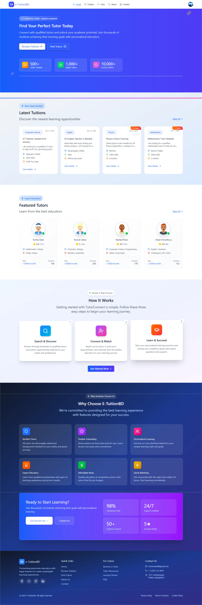
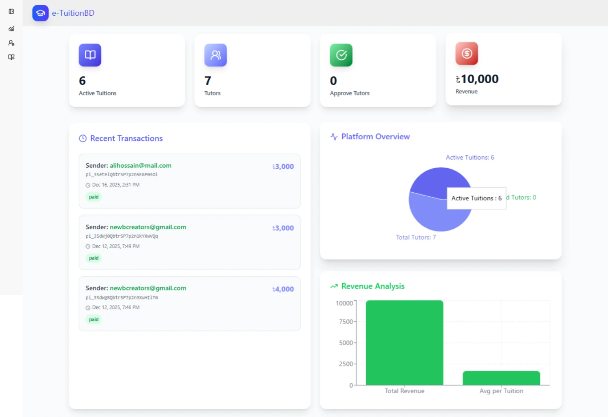

<br />
<div align="center">
  <a href="https://github.com/your_github_username/etuitionbd-repo-name">
    
  </a>

  <h3 align="center">e-TuitionBD</h3>

  <p align="center">
    The premier platform connecting verified, experienced tutors with students across Bangladesh.
    <br />
    <a href="https://etuitionbd-13475.web.app/"><strong>Visit the Live Site »</strong></a>
    <br />
  </p>
</div>

<details>
  <summary>Table of Contents</summary>
  <ol>
    <li><a href="#about-the-project">About The Project</a>
      <ul>
        <li><a href="#key-features">Key Features</a></li>
        <li><a href="#tech-stack">Tech Stack</a></li>
      </ul>
    </li>
    <li><a href="#getting-started">Getting Started</a>
      <ul>
        <li><a href="#prerequisites">Prerequisites</a></li>
        <li><a href="#installation">Installation</a></li>
      </ul>
    </li>
  </ol>
</details>

---

## 🏠 About The Project

e-TuitionBD is a comprehensive online marketplace built to solve the difficulty of finding reliable, skilled home and online tutors in major cities. The platform serves two primary user roles: **Guardians/Students** seeking tuition and **Tutors** looking for assignments.

### Key Features

* **User Authentication:** Secure sign-up/login for Tutors and Students.
* **Detailed Tutor Profiles:** Including academic background, subjects, areas of expertise, and expected salary.
* **Advanced Search & Filtering:** Allows guardians to filter tutors by area, class, subject & locations.
* **Application System:** Tutors can view and apply for open tuition jobs posted by guardians.
* **Admin Dashboard:** For verification of tutors, job moderation, and overall site management.

### Tech Stack

This project is structured as a full-stack application.

| Component | Technology | Badge | Notes |
| :--- | :--- | :--- | :--- |
| **Frontend** | React |  | Built with functional components and hooks. |
| **Styling** | Tailwind CSS |  | Modern, responsive design focus. |
| **Backend** | Firebase / Node.js (Express) |  | Handles authentication, data persistence, and cloud functions. |
| **Database** |  MongoDB |  | Structured data for tutors, jobs, and applications. |

<p align="right">(<a href="#readme-top">back to top</a>)</p>

---

## 🚀 Getting Started

To get a local copy of this project up and running, follow these simple steps.

### Prerequisites

You must have **Node.js** and **npm** installed on your machine.

* npm
    ```sh
    npm install npm@latest -g
    ```

### Installation

1.  **Clone the repository:**
    ```sh
    git clone https://github.com/IGNIT3-xD/eTuitionBd
    cd eTuitionBd
    ```

2.  **Setup Environment Variables:**
    Create a file named `.env` in the root directory and add your secret keys.
    ```
    # Example for Firebase
    FIREBASE_API_KEY=your_key_here
    ```

4.  **Run the application:**
    ```sh
    npm run dev 
    # or the command defined in your package.json to start the project
    ```

<p align="right">(<a href="#readme-top">back to top</a>)</p>

---
## 📸 Screenshots

### 🏠 Homepage


### 🔍 All Tuitions Page


### 👤 Settings Page


### 📊 Dashboard Page
  

## Feedback

If you have any feedback, please reach out to us at md.imranali2046@gmail.com  
Linkedin: https://www.linkedin.com/in/md-imran-ali-291498392/
